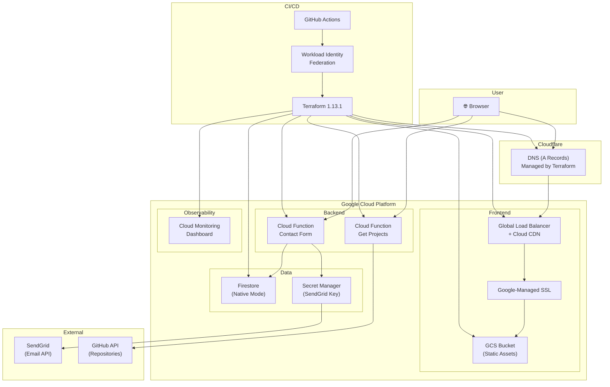

# 🚀 Serverless Portfolio — GCP Native

A fully automated, serverless portfolio website running on Google Cloud Platform with zero-touch CI/CD deployment.

[](https://github.com/yisakm9/portfolio-serverless-gcp/actions/workflows/deploy-infra.yml)

## 🌐 Live Site

**[https://yisakmesifin.org](https://yisakmesifin.org)**

## Architecture



## AWS → GCP Migration Map

| AWS Service | GCP Equivalent | Module |
|-------------|---------------|--------|
| S3 (Static Hosting) | GCS Bucket | `gcs_website` |
| CloudFront | Global LB + Cloud CDN | `cloud_cdn` |
| Lambda | Cloud Functions 2nd Gen | `cloud_function` |
| API Gateway | Built into Cloud Functions | — |
| DynamoDB | Firestore (Native) | `firestore` |
| SES | SendGrid (via Secret Manager) | — |
| CloudWatch | Cloud Monitoring | `monitoring` |
| IAM OIDC | Workload Identity Federation | `iam` |
| Route 53 | Cloudflare DNS (Terraform) | `cloudflare` |

## 🚀 Quick Start

### Prerequisites

- [gcloud CLI](https://cloud.google.com/sdk/docs/install) — authenticated (`gcloud auth login`)
- [gh CLI](https://cli.github.com/) — authenticated (`gh auth login`)
- [Terraform](https://developer.hashicorp.com/terraform/install) >= 1.13.1
- A GCP project
- A Cloudflare account with your domain
- A SendGrid account with an API key

### One-Time Bootstrap

```bash
# Clone the repository
git clone https://github.com/yisakm9/portfolio-serverless-gcp.git
cd portfolio-serverless-gcp

# Run the bootstrap script (sets up everything)
chmod +x bootstrap.sh
./bootstrap.sh
```

The bootstrap script handles:
- ✅ GCP API enablement (15 APIs)
- ✅ Terraform state bucket (GCS with versioning)
- ✅ Workload Identity Federation (keyless auth)
- ✅ GitHub Actions Service Account + IAM roles
- ✅ GitHub repository secrets
- ✅ Cloudflare API token
- ✅ SendGrid API key (Secret Manager)

### Deploy

```bash
# Push to main — GitHub Actions handles everything
git push origin main
```

That's it. The pipeline:
1. **Detects changes** (infra/backend/frontend)
2. **Deploys infrastructure** via Terraform (GCS, LB, CDN, Functions, Firestore, DNS)
3. **Builds & deploys frontend** (npm build → gsutil sync → CDN invalidation)

### Destroy

```bash
# Via GitHub Actions (safety confirmation required)
gh workflow run "Destroy Infrastructure" -f confirmation=DESTROY
```

This cleans up **everything** — GCP resources AND Cloudflare DNS records.

## 📁 Project Structure

```
├── bootstrap.sh                    # One-time setup script
├── .github/workflows/
│   ├── deploy-infra.yml            # Main production pipeline
│   ├── deploy-frontend.yml         # Frontend-only deploy (manual)
│   ├── deploy-backend.yml          # Backend-only deploy (manual)
│   └── destroy.yml                 # Teardown (manual, requires confirmation)
├── frontend/                       # React + Vite application
│   ├── src/
│   │   ├── App.jsx
│   │   ├── components/
│   │   │   ├── ContactForm.jsx
│   │   │   └── Projects.jsx
│   │   └── index.css
│   └── package.json
├── backend/
│   ├── contact_form/               # Cloud Function — Contact form
│   │   ├── main.py
│   │   └── requirements.txt
│   └── get_projects/               # Cloud Function — GitHub repos
│       ├── main.py
│       └── requirements.txt
└── terraform/
    ├── environments/dev/           # Root module (wires everything)
    │   ├── main.tf
    │   ├── provider.tf
    │   ├── variables.tf
    │   ├── outputs.tf
    │   └── backend.tf
    └── modules/
        ├── gcs_website/            # Static file hosting
        ├── cloud_cdn/              # Load Balancer + CDN + SSL
        ├── cloud_function/         # Serverless functions
        ├── firestore/              # NoSQL database
        ├── iam/                    # Service accounts + build perms
        ├── monitoring/             # Dashboard
        └── cloudflare/             # DNS records
```

## 🔒 Security

- **No service account keys** — Uses Workload Identity Federation for keyless GitHub → GCP auth
- **Least privilege** — Dedicated service accounts per function
- **Secret Manager** — API keys stored encrypted, never in code
- **Google-managed SSL** — Auto-renewed HTTPS certificates
- **IAM propagation delay** — 60s wait ensures permissions are active before use

## 🛠 Built With

- **Frontend**: React + Vite + TailwindCSS
- **Backend**: Python 3.12 + Cloud Functions 2nd Gen
- **Database**: Firestore (Native Mode)
- **Infrastructure**: Terraform 1.13.1
- **CI/CD**: GitHub Actions + Workload Identity Federation
- **DNS**: Cloudflare (managed by Terraform)
- **Email**: SendGrid
- **Monitoring**: Cloud Monitoring Dashboard

## 📄 License

MIT
